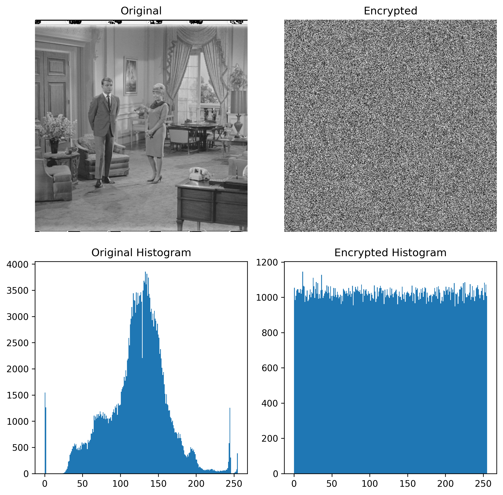

This repository contains 3 files;
Digital_Map_Generator.py contains all the k-depenedent formulas needed in order to operate the digital map, 
Digital_Map.py contians the digital map and the mixed digital map, as well as a helper function that converts the output of these maps into a bit-file, useful for NIST SP 800-22 testing, 
and Graphs.py contains graphs that plot the two successive steps of the logistic and/or digital map, and contains the cobweb plot for the logistic and digital map.
